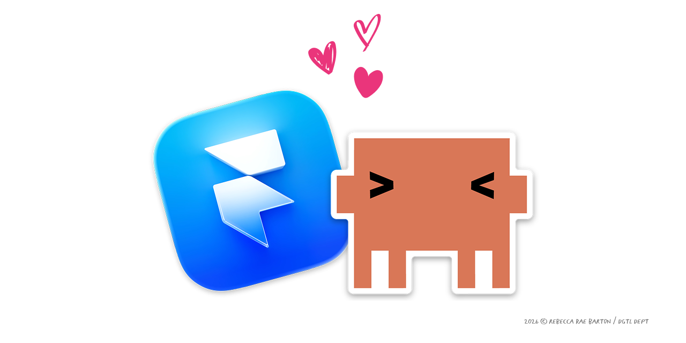

<div align="center">



<br>
<br>

# Framer Components

**Open-source code components and packages for Framer — built for designers who ship.**

[](https://framer.com)
[](https://linkedin.com/in/rebeccaraebarton)
[](https://x.com/rebeccarae)
[](https://dgtldept.substack.com)
[](https://rebeccaraebarton.com)
[](https://github.com/thatrebeccarae/framer-components/stargazers)
[](LICENSE)

<br>

```bash
git clone https://github.com/thatrebeccarae/framer-components.git
```

<br>

[Why I Built This](#why-i-built-this) · [Who This Is For](#who-this-is-for) · [Packages](#packages) · [Getting Started](#getting-started) · [Roadmap](ROADMAP.md) · [Related Repos](#related-repos) · [Contributing](#contributing) · [License](#license)

</div>

---

## Why I Built This

Framer is incredible for shipping fast, but the code component ecosystem is still young. I kept building the same patterns across client projects — link-in-bio pages, Substack feeds, interactive flourishes, music embeds — and decided to open-source the ones worth sharing.

These components are designed for non-technical Framer users. Each one comes with wizard-style documentation so you can drop it into your project without touching code. If you *do* want to customize, everything is a single `.tsx` file with clean props and no external dependencies.

The goal is simple: give Framer builders production-ready components that respect user privacy by default and just work.

## Who This Is For

- **Framer designers** who want production-ready code components without writing TypeScript from scratch
- **Freelancers and agencies** who rebuild the same patterns across client projects
- **Non-technical site owners** who need drop-in components with wizard-style setup docs
- **Privacy-conscious builders** who want analytics-optional components that dont phone home by default

## Packages

| Package | Description | Status |
|---------|-------------|--------|
| [LinkTree Replacement](./linktree-replacement) | Complete link-in-bio page with wizard docs, themes, and optional analytics | Ready |
| [Substack Integration](./substack-integration) | Paginated Substack feed + post counter, backed by a Cloudflare Worker proxy | Ready |
| [Music Pill](./music-pill) | Live Now-Playing Spotify card with animated header and Worker proxy | Ready |
| [Eye Tracker](./eye-tracker) | Animated eyes that follow the cursor with blinking and easter eggs | Ready |
| [Rolling Card Stack](./rolling-card-stack) | Animated card stack with smooth rolling transitions | Ready |
| [Fluid Typography](./fluid-typography) | Drop-in fluid heading scale, no media queries | Ready |

## Getting Started

Each package has its own installation instructions in its README. Generally:

1. Navigate to the package folder
2. Copy the `.tsx` file from `components/` (or the package root)
3. Paste into a new Code Component in your Framer project

<details>
<summary><strong>Detailed setup notes</strong></summary>

- Each component is a single `.tsx` file — no build step, no dependencies
- Framers Code Component editor accepts the file contents directly
- Theme and configuration options are exposed as Framer property controls
- Packages that talk to external APIs (Substack, Music Pill) require a one-time Cloudflare Worker deploy — see the package `docs/` folder for setup walkthroughs
- See each packages README for component-specific props and customization

</details>

## Related Repos

Other open-source work in the same orbit:

| Repo | What it is |
|------|------------|
| [**claude-marketing**](https://github.com/thatrebeccarae/claude-marketing) | 56 open-source Claude Code skills, agents, and workflows for marketing teams. Paid media, e-commerce, content, strategy, creative, and reporting. |
| [**substack-aeo-proxy**](https://github.com/dgtldept/substack-aeo-proxy) | Free Vercel proxy that injects JSON-LD structured data into Substack pages so AI crawlers (ChatGPT, Claude, Perplexity, Gemini) see your professional identity. |

If you build a Substack site in Framer, the natural stack is: **substack-integration** (this repo) for the feed UI, plus **substack-aeo-proxy** for AEO discoverability.

## Contributing

Pull requests welcome. If you build something useful on top of these components, Id love to see it. See [CONTRIBUTING.md](CONTRIBUTING.md) for PR conventions and the sync workflow.

## Security

To report a security or privacy issue, see [SECURITY.md](SECURITY.md).

## License

MIT — see [LICENSE](LICENSE) for details. Each package also ships a copy of the MIT license for clarity.

---

## About the author

I'm [Rebecca Rae Barton](https://rebeccaraebarton.com) — I run a marketing-and-engineering practice that ships product, content, and infrastructure for technical brands. Most of these components were extracted from client work where the same patterns kept showing up. Open-sourcing them is cheaper than rebuilding them in slightly different ways forever.

If any of this is useful to you, the easiest ways to follow what I'm building next:

- **Essays on marketing × engineering:** [dgtldept.substack.com](https://dgtldept.substack.com)
- **LinkedIn:** [linkedin.com/in/rebeccaraebarton](https://linkedin.com/in/rebeccaraebarton)
- **X:** [@rebeccarae](https://x.com/rebeccarae)
- **Live demos of these components in production:** [rebeccaraebarton.com/work](https://rebeccaraebarton.com/work)

<div align="center">

*Please don't be a jerk and steal my work.*

[GitHub](https://github.com/thatrebeccarae/framer-components) · [Substack](https://dgtldept.substack.com) · [LinkedIn](https://linkedin.com/in/rebeccaraebarton) · [+ more](https://rebeccaraebarton.com/work)

</div>
